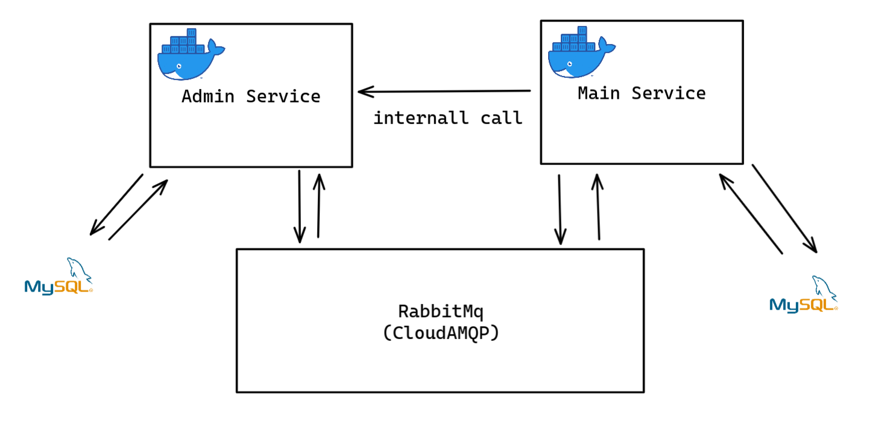

<h1 align="center">Laravel Microservices | Arquitetura orientada a eventos</h1>
<h3  align="center">Projeto de microserviços usando arquitetura orientada a eventos com os jobs(queue) do Laravel em dois serviços com propriedades de atribuição simples</h3>
 

    

 

<h2>Features</h2>

<ul>
<li>✅ Criação, atualização remoção de Produtos em serviço main atraves de chamada de evento</li>
<li>✅ Criação, atualização remoção e listagem de Produtos em serviço Admin</li>
<li>✅ Possibilidade de like de seriço main para serviço admin atraves de chamada interna</li>
</ul>

 

## Run
> Serviço 1 - Admin : http://localhost:8000 - Mysql localhost:33063
 

> Serviço 2 - Main : http://localhost:8001 - Mysql localhost:33064

- **Entrar na pasta de cada projeto e rodar `composer install`**
- **Após isso configurar o `.env` de cada projeto como banco de dados, o drive de fila, e o message broker**
- **Após isso excutar as migrations excutando no sh do container `php artisan migrations`**
- **Entrar na pasta de cada projeto e rodar `docker-compose up`**
- **Para acessar o terminal sh de cada container execute `docker-compose exec admin sh` para o container de serviço admin e `docker-compose exec main sh` para o container do serviço main**
- **As filas por padrao ja estao sendo executadas no container**
 

## CloudAMQP
- **Neste projeto o rabbitmq instaciado foi usado em cloud**
- **Acesse em <a>https://www.cloudamqp.com/</a> para criar uma instância própria**
- **Após iss configurar os dados de suas instância no `.env`**

